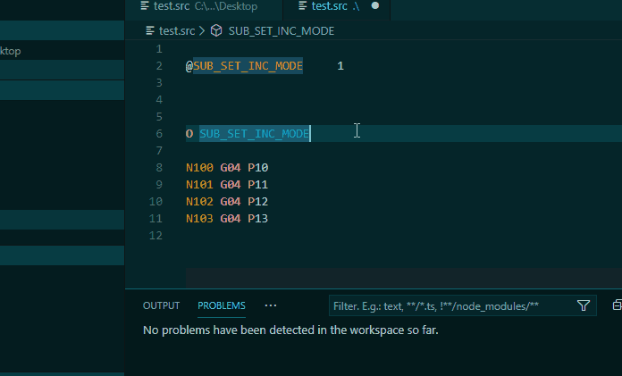
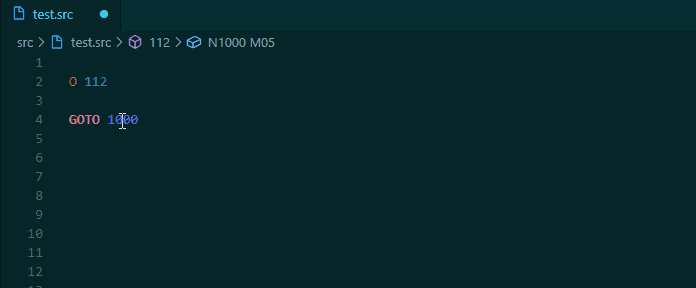
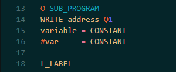

# Fanuc Macro Executor extension for Visual Studio Code


[](https://github.com/iSorp/macro-executor/issues)
[](https://opensource.org/licenses/MIT)
[](https://dev.azure.com/iSorp/fanuc-macro-executor/_build/latest?definitionId=2&branchName=master)


Visual Studio Code extension with support for the Fanuc Macro Executor programming language including syntax highlighting, validating and project building. 


## News
- [Multi-Root Workspaces](#multi-root-workspaces)
- [Custom Keywords](#custom-keywords)

***
       

## Features
* Compiling and linking
* Compiler problem matcher
* Syntax/Semantic highlighting
* Syntax validation
* Symbol provider
* Completion provider
* CodeLens
* Lint features
* Sequence number refactoring

## Supported display languages
* English `en`
* Deutsch `de`
* 中文 `zh-cn`

## Required file extensions
* Macro files`.src`
* Include files `.def` 
* Link files `.lnk` 

## Coding conventions
* `$Include` paths must be absolute or relative to the workspace folder
* Uppercase for constants: `@MY_CONSTANT 100`
* Space between statements: `O SUB_PROGRAM; N9000 G01 X1; DO 1; END 1; GOTO 1` etc.
* A comment of a declaration `@var` <span style="color:green">**/* my comment**</span> is displayed on hover and completion

## Validation


## References
The reference service supports the search for the following types:
* Symbols
* Labels
* Sequence numbers
* GOTO Label/sequence numbers
* M-Codes and G-Codes
* Macro variables (#..) 
* Addresses

The search for symbol and label references is global (workspace) if the definitions are included by a definition file `.def`, otherwise the search is limited to the current file scope. Sequence numbers only can be found within a file scope (there is currently no function scope available).

### Sequence number definition


### Symbol references


## Implementations

Implementations of one of the following types are found by the implementations search service:

* Subprograms
* Label statements
* GOTO Label/Sequence number 

The global / local search behavior is equal to the reference search.


## Sequence number refactoring for functions
* Consecutive numbering on completion (snippet N-Number)
* Command for renumbering sequences (incl. GOTOs)
* Command for adding missing sequences (for NC statements)


## Semantic highlighting

Semantic highlighting is used to highlight the represented type of a symbol. Following types are supported:
* M-Code and G-Code
* Address
* Macro variable
* Constant
* Label

For some color themes, the semantic highlighting must be enabled in the settings:

```json
"editor.semanticTokenColorCustomizations": {
       "enabled": true,
}
```

| disabled | enabled     |
|:-------------:|:-------------:|
|  |  |


*The color theme used in screenshot →* **[Noctis](https://marketplace.visualstudio.com/items?itemName=liviuschera.noctis#review-details)**

## Custom Keywords

* Symbol highlighting
* Symbol description for hover and completion

Out of the box the extension supports semantic highlighting for Labels (>symbol), Variables (@symbol) and M/G-Codes. Sometimes it could be useful to change the default highlighting for a particular symbol or for a type like a macro variable. 
Such a customization can be achieved by adding custom keyword items to the configuration property `macro.keywords` in the user/workspace settings:


|     **Keyword item**| | 
|-------------|----------------------------|
| symbol      | Symbol text                |
| scope       | [Scopes](#Scopes)           |
| nodeType    | Label, Code (M/G), Variable (all @ symbols)   |
| description | Markdown `string` \| `string[]`   |


The field `nodeType` defines the related type in the macro program. If the field is empty, a keyword item affects all symbol occurrences regardless of the symbols type. E.g. if you want to add a hover text to a particular P-Code variable, an item could be structed as follows:

```json
{
       "symbol": "10000",
       "nodeType" :"Variable",
       "description": "some variable text"
}
```

### Scopes
|    | Style for compile-time Variable nodeType | 
|-----------|---------------------------------------|
| number    | Numeric (@var  10000) |
| macrovar  | Macro variable (@var     #10000)             |
| constant  | Constant numeric (@UPPER  10000)             |
| language  | Language constant (e.g. true/false)          |
| label     | Label                                        |
| code      | M-Code/G-Code                                |
| parameter | NC-Parameter                                 |
| address   | Address                                      |


 These scopes are used internally and are responsible for the symbol style which depends on the chosen color theme like **[Noctis](https://marketplace.visualstudio.com/items?itemName=liviuschera.noctis#review-details)**. To override the style just add **[rules](https://github.com/microsoft/vscode/wiki/Semantic-Highlighting-Overview#as-a-theme-author-do-i-need-to-change-my-theme-to-make-it-work-with-semantic-highlighting)** to the `editor.semanticTokenColorCustomizations` configuration property.
 
In case the default scopes should be unchanged, the additional custom scopes `custom_1` - `custom_5` could be used:


### Example

The following example changes the symbol `M08`, which has a default scope `code`, to `custom_1` and the scope `custom_1` is associated with the color red:

```json
"macro.keywords" : [
       {
              "symbol": "M08",
              "scope": "custom_1",
              "description": ["*Coolant*", "ON"]
       }
],

"editor.semanticTokenColorCustomizations": {
       "enabled": true,
       "rules": {
              "custom_1": "#ff0000"
       }
},
```

**[Example](https://github.com/iSorp/macro-executor/tree/master/doc/settings.example.json)**


## Multi-Root Workspaces
The extension supports [multi-root workspaces](https://code.visualstudio.com/docs/editor/multi-root-workspaces). Each workspace is handled as a separate macro project.
This could be useful if a fanuc project consists of several controls e.g machine and handling:


## Lint
The Lint is configurable by changing the following rules in the settings (user or workspace).
Three levels are supported: `error`, `warning` and `ignore`. 

```json
"macro.lint": {
       "rules" : {
              "duplicateInclude":         "error",
              "duplicateDeclaration":     "error",
              "duplicateFunction":        "warning",
              "duplicateAddress":         "ignore",
              "duplicateSequence":        "warning",
              "duplicateLabel":           "warning",
              "duplicateLabelSequence":   "warning",
              "unknownSymbol":            "error",
              "whileLogicOperator":       "error",
              "doEndNumberTooBig":        "error",
              "doEndNumberNotEqual":      "error",
              "nestingTooDeep":           "error",
              "duplicateDoEndNumber":     "warning",
              "mixedConditionals":        "error",
              "tooManyConditionals":      "error",
              "seqNotFound":              "error",   
              "incompleteParameter":      "error",
              "includeNotFound":          "error",
              "assignmentConstant":       "warning"
       }
```

## Default Commands

| Command | Key          |
|---------|--------------|
| Build   | Ctrl+Shift+B |
| Link / build all    | Ctrl+Shift+L |
| Clean   | Ctrl+Shift+C |


## Extension Settings

This extension contributes the following settings:

* `macro.keywords` : [Custom Keywords](#custom-Keywords)
* `macro.lint`: Lint settings and rule configuration
* `macro.sequence.base`: Sequences start number for refactoring
* `macro.sequence.increment`: Sequences increment for refactoring
* `macro.codelens.enable`: Enables or disables the CodeLens function. **Deprecated**: Please use `editor.codeLens` instead.
* `macro.validate.enable`: Enables or disables the validation
* `macro.validate.workspace`: Enables or disables the workspace validation

Build settings:
* `macro.build.compiler`: Selection of the macro compiler
* `macro.build.controlType`: Selection of the control type
* `macro.build.compilerParams`: Additional compiler parameters: -NR, -L1, -L2, -L3, -PR
* `macro.build.makeFile`: The path to the makefile
* `macro.project.exportPath`: The path to the directory for the memory card file (.mem)
* `macro.project.sourcePath`: The path to the directory for the source files (.src)
* `macro.project.buildPath`: The path to the directory for the build files
* `macro.project.linkPath`: The path to the directory for the link files (.lnk) and the library (.mex)


## External build system
The building process can be performed by using an external script or the internal system. If an external script is used,
just set the path in `macro.build.makeFile`. If a `clean` script in the same directory exists, it is used for the cleaning process.
The following parameters are passed to the external script: 

1. Export directory
2. Option [make, clean].
3. Compiler
4. Control type parameter


## Internal build system
If `macro.build.makeFile` is empty the internal system is used.
>- Currently only working with powershell (select default shell -> powershell)
>- The compiler must be available over the system path
>- All `.src` files under the folder `macro.project.sourcePath` and its subfolders will be compiled
>- There are two ways to define a libray path in a link file:
>      1. absolute: *CNC=C:\lib.mex*
>      2. relative: *CNC=..\lnk\lib.mex* (relative to `macro.project.buildPath`)

### Example

#### Directory tree
```
project 
│
└───src
│   │   file1.src
│   │   file2.src  
│   │ 
│   └───sub
│           file3.src
│           file4.src 
└───def
│      file1.def
│      file2.def
│ 
└───lnk
│      file1.lnk
│      file2.lnk
│      F30iA_01.MEX
│
└───bin
       .rom
       .ref
       .prg
```

#### Settings


The path settings could also be empty if no further directory tree is needed
* `macro.project.exportPath`
* `macro.project.sourcePath`
* `macro.project.buildPath`

#### Link file

```
CNC=..\lnk\F30iA_01.MEX
```

#### Source file

```
/* file1.src
$INCLUDE def\file1.def
```

```  
/* file3.src
$INCLUDE def\file2.def
```


## 16 bit Compiler

A convenient way to compile 16 bit macro programs if the host system doesn't support it, is to use [Dosbox](https://www.dosbox.com/). 
Below an example [task](https://code.visualstudio.com/Docs/editor/tasks) definition which executes dosbox and passes the build script as command line argument.

```json
{
       "label": "Fanuc Macro 16bit build",
       "type": "shell",
       "command": "C:/Program Files (x86)/DOSBox-0.74-3/DOSBox.exe",
       "args": [
              "Make.bat",
              "-noconsole"
       ],
       "group": {
              "kind": "build",
              "isDefault": true
       },
       "presentation": {
              "echo": true,
              "reveal": "always",
              "focus": false,
              "panel": "shared",
              "showReuseMessage": true,
              "clear": false
       },
       "problemMatcher": []
}
```


-----------------------------------------------------------------------------------------------------------


## Credits

Special thanks to Pan and Yu for translating the chinese texts

特别感谢潘先生和于先生翻译了中文文本