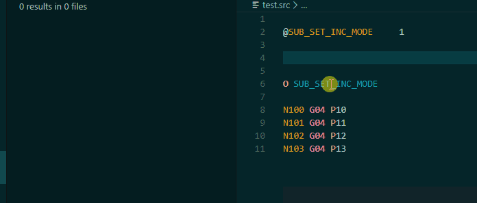
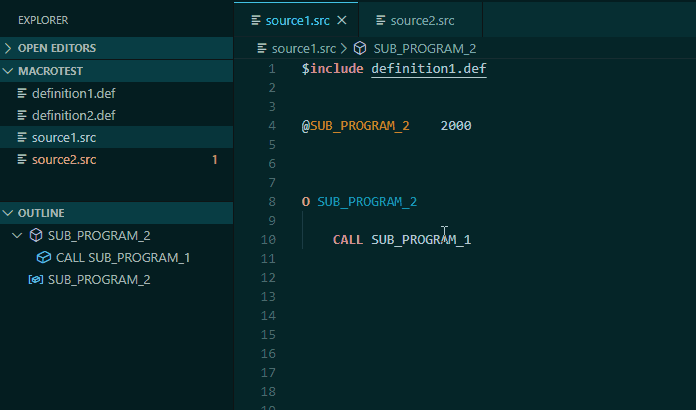

# Fanuc Macro Executor


[](https://github.com/iSorp/macro-executor/issues)
[](https://opensource.org/licenses/MIT)


Fanuc Macro Executor syntax highlighting, validating and project building 


## News
- [Semantic highlighting](#highlighting)
- [Additional compiler parameters](#ExtensionSettings)
- Array support (e.g var<#1>)
- Custom macro commands
       
***
       
To enable the semantic highlighting add the following property to your settings

```
"editor.semanticTokenColorCustomizations": {
       "enabled": true,
}
```

***
       

## Features
* Compiling and linking
* Compiler problem matcher
* Syntax/Semantic highlighting
* Syntax validation
* Symbol provider
* Completion provider
* CodeLens
* Lint features
* Sequence number refactoring


### Validation


### Navigation


### References


### Implementations


## Supported display languages
* English `en`
* Deutsch `de`
* 中文 `zh-cn`

## Required file extensions
* Macro files`.src`
* Include files `.def` 
* Link files `.lnk` 

## Coding conventions
* `$Include` paths must be absolute or relative to the workspace folder
* Uppercase for constants: `@MY_CONSTANT 100`
* Space between statements: `O SUB_PROGRAM; N9000 G01 X1; DO 1; END 1; GOTO 1` etc.
* A comment of a declaration `@var` <span style="color:green">**/* my comment**</span> is displayed on hover and completion

## Sequence number refactoring for functions
* Consecutive numbering on completion (snippet N-Number)
* Command for renumbering sequences (incl. GOTOs)
* Command for adding missing sequences (for NC statements)


<a name="highlighting"></a>

## Semantic highlighting

Semantic highlighting is used to highlight the represented type of a symbol. Following types are supported:
* M-Code and G-Code
* PMC Address
* Macro variable
* Constant
* Label

For some color themes, the semantic highlighting must be enabled in the settings:

```
"editor.semanticTokenColorCustomizations": {
       "enabled": true,
}
```


*The color theme used in screenshot →* **[Noctis](https://marketplace.visualstudio.com/items?itemName=liviuschera.noctis#review-details)**


## Lint
The Lint is configurable by changing the following rules in the settings (user or workspace).
Three levels are supported: `error`, `warning` and `ignore`. 

```json
"macro.lint": {
       "rules" : {
              "duplicateInclude":         "error",
              "duplicateDeclaration":     "error",
              "duplicateFunction":        "warning",
              "duplicateAddress":         "ignore",
              "duplicateSequence":        "warning",
              "duplicateLabel":           "warning",
              "duplicateLabelSequence":   "warning",
              "unknownSymbol":            "error",
              "whileLogicOperator":       "error",
              "doEndNumberTooBig":        "error",
              "doEndNumberNotEqual":      "error",
              "nestingTooDeep":           "error",
              "duplicateDoEndNumber":     "warning",
              "mixedConditionals":        "error",
              "tooManyConditionals":      "error",
              "incompleteParameter":      "error",
              "includeNotFound":          "error",
              "assignmentConstant":       "warning"
       }
```

## Default Commands

| Command | Key          |
|---------|--------------|
| Build   | Ctrl+Shift+B |
| Link / build all    | Ctrl+Shift+L |
| Clean   | Ctrl+Shift+C |


<a name="settings"></a>

## Extension Settings

This extension contributes the following settings:

* `macro.lint`: Lint settings and rule configuration
* `macro.sequence.base`: Sequences start number for refactoring
* `macro.sequence.increment`: Sequences increment for refactoring
* `macro.codelens.enable`: Enables or disables the CodeLens function
* `macro.validate.enable`: Enables or disables the validation
* `macro.validate.workspace`: Enables or disables the workspace validation

Build settings:
* `macro.build.compiler`: Selection of the macro compiler
* `macro.build.controlType`: Selection of the control type
* `macro.build.compilerParams`: Additional compiler parameters: -NR, -L1, -L2, -L3, -PR
* `macro.build.makeFile`: The path to the makefile
* `macro.project.exportPath`: The path to the directory for the memory card file (.mem)
* `macro.project.sourcePath`: The path to the directory for the source files (.src)
* `macro.project.buildPath`: The path to the directory for the build files
* `macro.project.linkPath`: The path to the directory for the link files (.lnk) and the library (.mex)


## External build system
The building process can be performed by using an external script or the internal system. If an external script is used,
just set the path in `macro.build.makeFile`. If a `clean` script in the same directory exists, it is used for the cleaning process.
The following parameters are passed to the external script: 

1. Export directory
2. Option [make, clean].
3. Compiler
4. Control type parameter

<a name="ExtensionSettings"></a>

## Internal build system
If `macro.build.makeFile` is empty the internal system is used.
>- The compiler must be available over the system path
>- All `.src` files under the folder `macro.project.sourcePath` and its subfolders will be compiled
>- There are two ways to define a libray path in a link file:
>      1. absolute: *CNC=C:\lib.mex*
>      2. relative: *CNC=..\lnk\lib.mex* (relative to `macro.project.buildPath`)

### Example

#### Directory tree
```
project 
│
└───src
│   │   file1.src
│   │   file2.src  
│   │ 
│   └───sub
│           file3.src
│           file4.src 
└───def
│      file1.def
│      file2.def
│ 
└───lnk
│      file1.lnk
│      file2.lnk
│      F30iA_01.MEX
│
└───bin
       .rom
       .ref
       .prg
```

#### Settings


The path settings could also be empty if no further directory tree is needed
* `macro.project.exportPath`
* `macro.project.sourcePath`
* `macro.project.buildPath`

#### Link file

```
CNC=..\lnk\F30iA_01.MEX
```

#### Source file

```
/* file1.src
$INCLUDE def\file1.def
```

```  
/* file3.src
$INCLUDE def\file2.def
```

-----------------------------------------------------------------------------------------------------------


## Credits

Special thanks to Pan and Yu for translating the chinese texts

特别感谢潘先生和于先生翻译了中文文本
